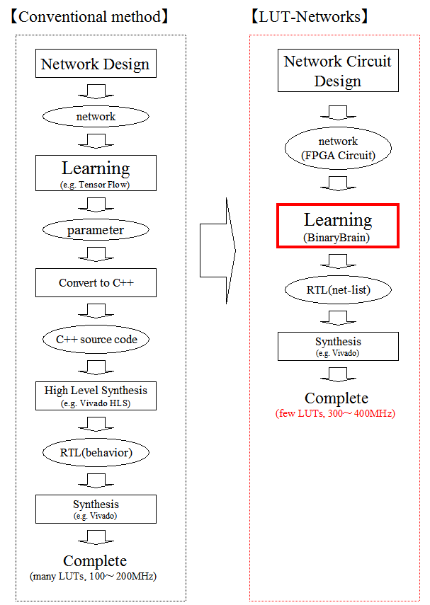
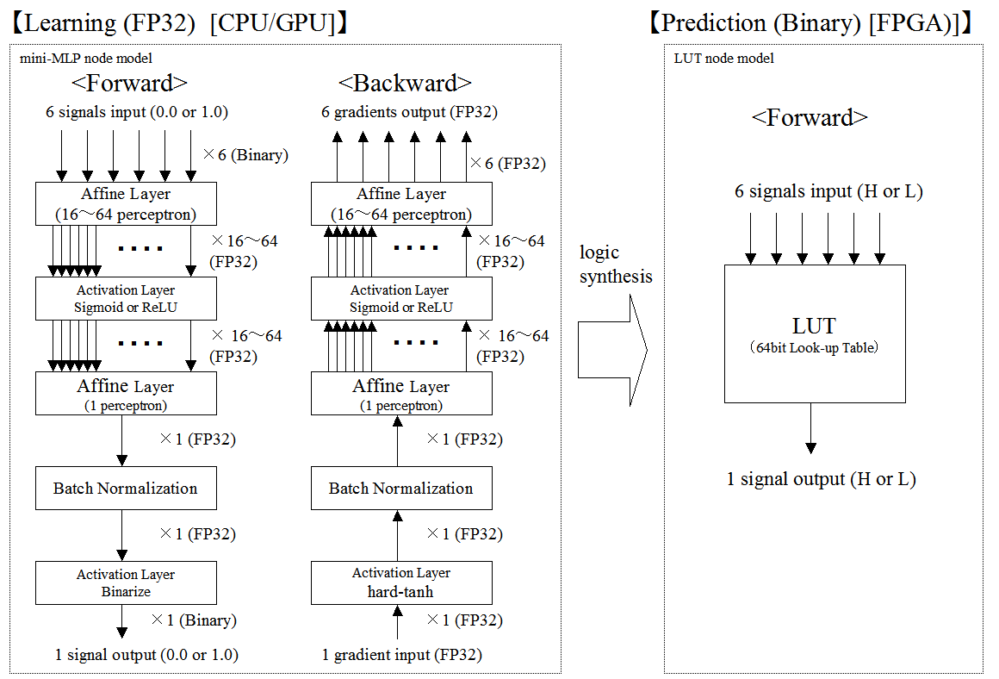
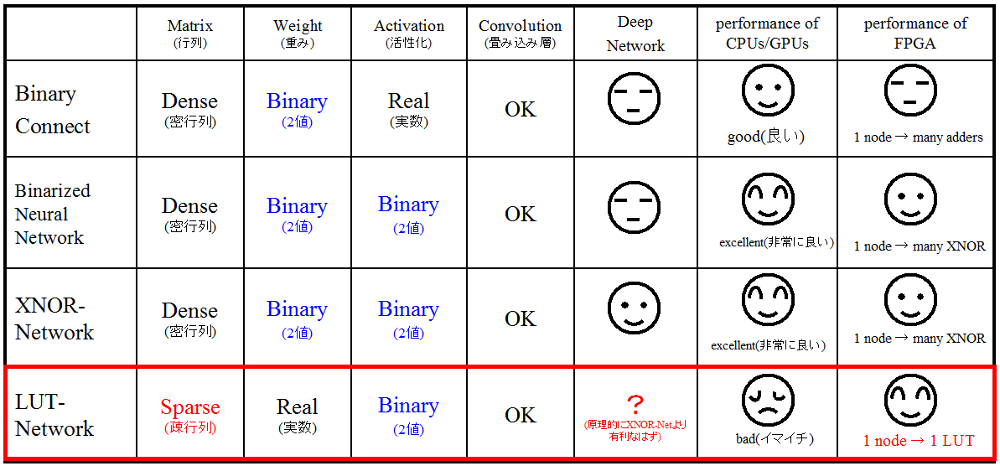
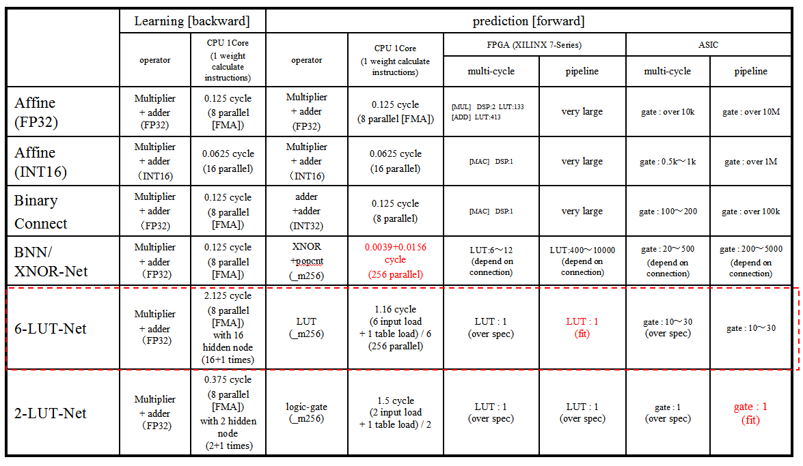

# BinaryBrain <br> --binary neural networks evaluation platform for LUT-networks

## Abstract
"LUT Networks" is one of the "Binary Deep Neural Networks" for FPGA.
This network run high-performance prediction on FPGA.


## How to use sample program (MNIST)
### windows
1. install VisualStudio 2015. 
2. git clone --recursive https://github.com/ryuz/BinaryBrain.git 
3. download MNIST from http://yann.lecun.com/exdb/mnist/
4. decompress MNIST for "\sample\mnist"
5. open VC++ solution "sample\mnist\sample_mnist.sln"
6. build "x64 Release"
7. run

### Linux(Ubuntu 18.04.1)
1. install tools 
```
% sudo apt install make
% sudo apt install g++
% sudo apt install clang
% sudo apt install git
```
2. build and run
```
% git clone --recursive https://github.com/ryuz/BinaryBrain.git
% cd BinaryBrain/sample/mnist
% cd make all
% cd make run
```


## What is LUT networks?
### Design flow
FPGA circuit is constructed from LUTs.
This platform let the LUT's table learn directly.



### layer model
One LUT can calcurate XOR. But one perceptron node can't learn XOR.
LUT-Network's one node has a hidden perceptrons.


### LUT node model
One LUT's equivalent model is many perceptron that has hidden layer.


Learning model of LUT-Network is shown below.


### Difference from other binary deep neural network
Though LUT-Network is binary nwtwork, it has FP32 weight parameter. Only activation layer's output is binary.




### Performance  estimations
LUT-network's learning cost is heavy, but prediction computing performanse of FPGA is very high.




## Author's information
- e-mail : ryuji.fuchikami@nifty.com
- github : https://github.com/ryuz/BinaryBrain
- blog : http://ryuz.txt-nifty.com
- twitter : https://twitter.com/ryuz88
- web-site : http://ryuz.my.coocan.jp/


## Reference
- BinaryConnect: Training Deep Neural Networks with binary weights during propagations<br>
https://arxiv.org/pdf/1511.00363.pdf

- Binarized Neural Networks<br>
https://arxiv.org/abs/1602.02505

- Binarized Neural Networks: Training Deep Neural Networks with Weights and Activations Constrained to +1 or -1<br>
https://arxiv.org/abs/1602.02830

- XNOR-Net: ImageNet Classification Using Binary Convolutional Neural Networks<br>
https://arxiv.org/abs/1603.05279

- Xilinx UltraScale Architecture Configurable Logic Block User Guide<br>
https://japan.xilinx.com/support/documentation/user_guides/ug574-ultrascale-clb.pdf
 


# 日本語説明(old README)
FPGAのLUTをダイレクトに学習させることを目標とした、バイナリニューラルネット用のライブラリを整理中です。
基本的にはヘッダファイルのみのライブラリとする見込みです。

AXV2以降の命令が使えるCPUと、Windows7以降の環境を想定しております。

CEREAL や EIGEN など、submoduleとして、他のライブラリを用いていますので、それらは個別にライセンスを確認ください。

現在 git にあるオリジナルのソースコード部分のライセンスは MIT ライセンスとしております。

